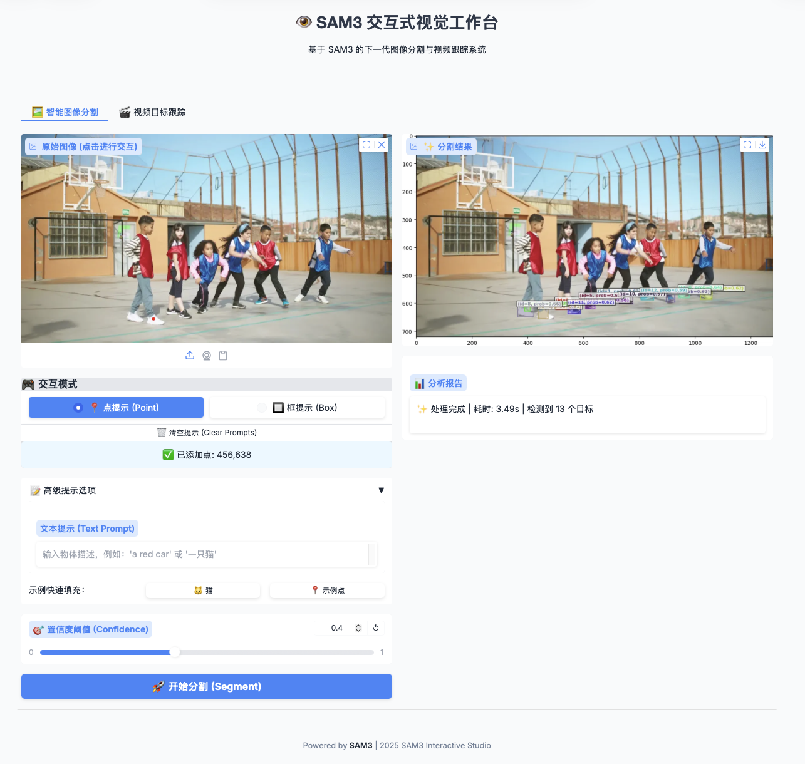
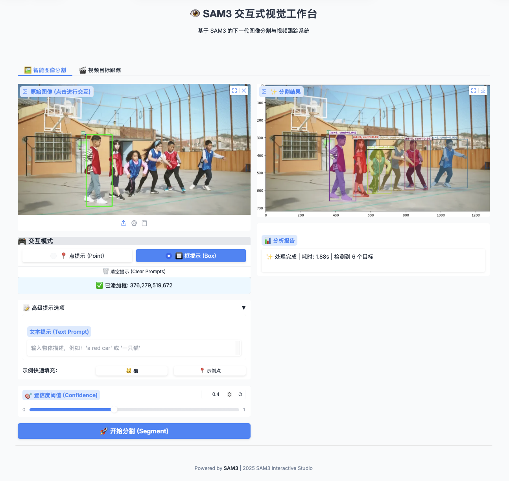

# SAM3 Interactive Vision Studio (SAM3 交互式视觉工作台)

<div align="center">

# 👁️ SAM3 Interactive Vision Studio

**基于 SAM3 的下一代交互式图像分割与视频跟踪系统**

[功能特性] • [安装指南] • [快速开始] • [交互说明]

</div>

---

## 📖 项目简介

**SAM3 Interactive Vision Studio** 是一个基于 Meta 最新 Segment Anything Model 3 (SAM3) 构建的高级可视化系统。本项目旨在提供一个直观、现代化的 Web 界面，让用户能够轻松体验 SAM3 强大的图像分割和视频对象跟踪能力。

相较于原始的命令行或简易 Demo，本项目提供了：
- **现代化的 UI 设计**：基于 Gradio Soft 主题的精美界面。
- **实时交互反馈**：支持在图像上直接点击进行**点提示 (Point Prompt)** 和 **框提示 (Box Prompt)**，并提供实时视觉反馈（画点、画框）。
- **多模态输入**：支持文本描述、几何提示（点/框）及其组合。
- **视频流处理**：支持上传视频并基于第一帧文本提示进行长时目标跟踪。

## ✨ 核心功能

### 1. 🖼️ 智能图像分割
- **点提示 (Point Prompt)**：单击图像任意位置，模型自动分割包含该点的物体。支持多点输入。
  > 
- **框提示 (Box Prompt)**：通过两次点击（左上角、右下角）确立一个矩形框，模型分割框内的物体。
  > 
- **文本提示 (Text Prompt)**：输入自然语言（如 "a cat", "red car"），模型自动识别并分割对应物体。
  > 
- **置信度调节**：动态调整阈值，过滤低置信度的预测结果。

### 2. 🎬 视频目标跟踪
- **长时跟踪**：上传视频文件，输入首帧目标的文本描述。
- **记忆传播**：SAM3 利用其强大的记忆机制，在整个视频序列中稳定跟踪目标，处理遮挡和形变。
- **结果可视化**：自动生成带有半透明掩码叠加的视频结果。
  > 

## 🛠️ 安装指南

### 环境要求
- Python 3.12+
- PyTorch 2.7+
- CUDA 12.6+ 兼容的 GPU

### 1. 创建虚拟环境并安装 PyTorch (参考 SAM3 官方指南)

建议使用 Conda 创建独立环境：

```bash
# 1. 创建并激活新的 Conda 环境
conda create -n sam3 python=3.12
conda deactivate
conda activate sam3

# 2. 安装支持 CUDA 的 PyTorch
pip install torch==2.7.0 torchvision torchaudio --index-url https://download.pytorch.org/whl/cu126
```

### 2. 安装 SAM3-gradio 及项目依赖

```bash
# 1. 克隆本项目 (SAM3-gradio)
git clone https://github.com/Pytorchlover/sam3-gradio.git
cd sam3-gradio

# 2. 安装项目依赖 (包含本地 SAM3 源码)
pip install -e .

# 2. 安装本演示系统所需的额外依赖 (Gradio, OpenCV 等)
pip install gradio opencv-python matplotlib
# 或者如果 requirements.txt 存在：
# pip install -r requirements.txt
```

### 3. 下载模型权重
本项目需要 SAM3 的预训练权重和 BPE 词表文件。
1. 创建 `models` 目录。
2. 将 `sam3.pt` 放入 `models/` 目录。
3. 确保 `assets/bpe_simple_vocab_16e6.txt.gz` 存在。

*如果启动时未找到模型，系统会提示尝试自动下载。*

## 🚀 快速开始

运行以下命令启动 Web 服务：

```bash
python sam3_gradio_demo.py
```

启动成功后，控制台会显示访问地址，通常为：
`http://localhost:7890`

## 🎮 交互操作说明

### 图像分割模式
1. **上传图像**：将图片拖入或点击上传。
2. **选择交互模式**：
   - **📍 点提示**：鼠标左键单击图像中的目标物体。图像上会出现🔴红点标记。
   - **🔲 框提示**：鼠标左键单击目标的**左上角**（出现🔵蓝点），再次单击**右下角**（出现🟢绿框）。
3. **添加文本（可选）**：在文本框输入描述。
4. **执行分割**：点击 **🚀 开始分割** 按钮。
5. **重置**：点击 **🗑️ 清空提示** 可移除所有标记并重置图像。

### 视频跟踪模式
1. **上传视频**：支持 MP4 等常见格式。
2. **输入描述**：在“跟踪目标描述”框中输入要跟踪对象的文本描述。
3. **执行处理**：点击 **▶️ 开始跟踪处理**。

## 📝 注意事项
- **显存占用**：视频处理较为消耗显存，处理高分辨率或长视频时请留意显存使用情况。
- **首次运行**：模型加载可能需要几秒钟，请耐心等待。

---
<div align="center">
Powered by SAM3 Model | Developed for Research & Demonstration
</div>
